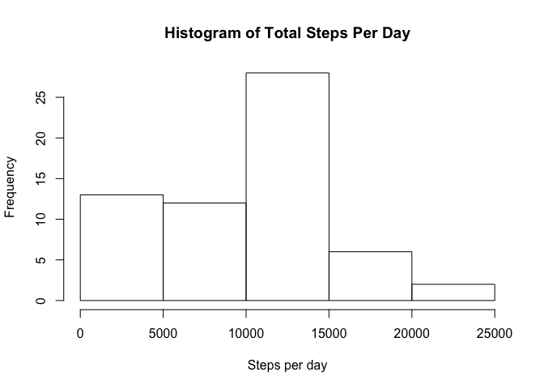
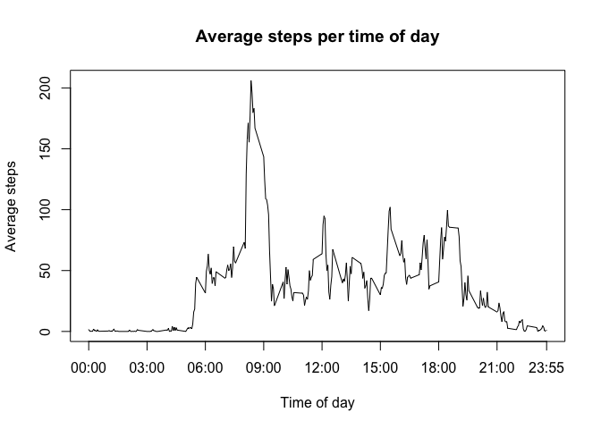
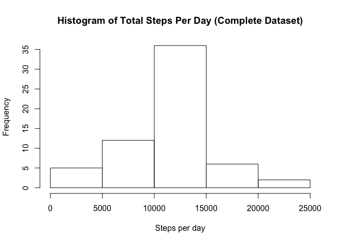
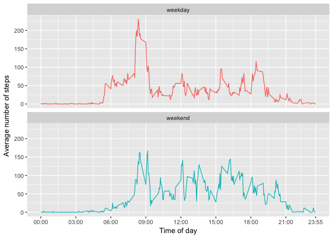

# Reproducible Research: Peer Assessment 1


## Loading and preprocessing the data

```r
library(data.table)
unzip('activity.zip', overwrite = TRUE)
activity_data <- data.table(
    read.csv('activity.csv', colClasses=c('integer', 'Date', 'integer'))
)
```


## What is mean total number of steps taken per day?

Since the data for some days are missing, the rows with missing counts for steps 
will skew the average/median, as the aggregations for some dates will be 0.


```r
total_steps_per_day <- with(
    activity_data, 
    tapply(steps, date, sum, na.rm = TRUE)
)
hist(total_steps_per_day, 
     main='Histogram of Total Steps Per Day', xlab='Steps per day')
```

<!-- -->

```r
mean_steps <- mean(total_steps_per_day)
median_steps <- median(total_steps_per_day)
```

The mean numbers of steps taken per day is **9354** 
and the median total number of steps taken per day is **10395**.


## What is the average daily activity pattern?

```r
average_steps_per_interval <- data.table(
    with(activity_data, aggregate(steps, list(interval), mean, na.rm=TRUE))
)
names(average_steps_per_interval) <- c('interval', 'steps')

make_time_labels <- function (x) {
    gsub('\\d*(\\d{2})(\\d{2})$', '\\1:\\2', paste0('000', x), perl=TRUE)
}

tick_marks = c(0, 300, 600, 900, 1200, 1500, 1800, 2100, 2355)
labels = make_time_labels(tick_marks)
with(
    average_steps_per_interval, 
    plot(interval, steps, xaxt='n', type='l', xlab='Time of day', 
         ylab='Average steps', main='Average steps per time of day')
)
axis(1, at=tick_marks, labels=labels)
```

<!-- -->

```r
interval_with_max_steps <- average_steps_per_interval[
    which.max(average_steps_per_interval$steps)
]$interval
time_of_day_with_max_steps <- make_time_labels(interval_with_max_steps)
```

The 5-minute interval with the maximum average number of steps is 
**835**, or **08:35**.


## Imputing missing values

```r
total_missing <- sum(!complete.cases(activity_data))
steps_missing <- sum(is.na(activity_data$steps))
date_missing <- sum(is.na(activity_data$date))
interval_missing <- sum(is.na(activity_data$interval))
```

There are **2304** rows with missing values. There are 
**2304** steps missing, **0** dates missing, and
**0** intervals missing. The only variable with missing
values is **steps**.

Those missing values will be filled in using the rounded average number of steps
for the associated 5-minute interval they represent.

```r
complete_activity_data <- copy(activity_data)
complete_activity_data[
    average_steps_per_interval, 
    steps:=ifelse(is.na(steps), as.integer(round(i.steps)), steps), 
    on='interval']
```

```
##        steps       date interval
##     1:     2 2012-10-01        0
##     2:     0 2012-10-01        5
##     3:     0 2012-10-01       10
##     4:     0 2012-10-01       15
##     5:     0 2012-10-01       20
##    ---                          
## 17564:     5 2012-11-30     2335
## 17565:     3 2012-11-30     2340
## 17566:     1 2012-11-30     2345
## 17567:     0 2012-11-30     2350
## 17568:     1 2012-11-30     2355
```

```r
total_steps_per_day_complete <- with(
    complete_activity_data, 
    tapply(steps, date, sum)
)
hist(total_steps_per_day_complete, 
     main='Histogram of Total Steps Per Day (Complete Dataset)', 
     xlab='Steps per day')
```

<!-- -->

```r
mean_steps_complete <- mean(total_steps_per_day_complete)
median_steps_complete <- median(total_steps_per_day_complete)
```

**After imputing the missing data**, the mean numbers of steps taken per day is
**10765** and the median total number of steps 
taken per day is **10762**.

| Dataset  | Mean Steps per Day                  | Median Steps per Day      |
| -------- | ----------------------------------- | ------------------------- |
| Original | 9354          | 10395          |
| Complete | 10765 | 10762 |

As the table above shows, the original data provided means and medians 
that were heavily skewed since the aggregations for some of the days were 0. For
that very reason, the histogram above displays a much higher frequency for total
steps in the 10000 to 15000 range, and a much lower one for the 0 to 5000 steps
range.

The estimations for the total number of daily steps greatly increase after 
imputing the missing data.


## Are there differences in activity patterns between weekdays and weekends?

```r
library(ggplot2)
complete_activity_data$date_type <- as.factor(ifelse(
    weekdays(complete_activity_data$date, abbreviate=TRUE) %in% c('Sat', 'Sun'), 
    'weekend', 'weekday'
))

average_steps_per_interval_complete <- data.table(
    with(complete_activity_data, 
         aggregate(steps, list(interval, date_type), mean, na.rm=TRUE)
    )
)
names(average_steps_per_interval_complete) <- c(
    'interval', 'date_type', 'steps')

ggplot(average_steps_per_interval_complete, aes(interval, steps, color=date_type)) + 
    scale_x_continuous(breaks=tick_marks, labels=labels) +
    geom_line() +
    facet_wrap('date_type', ncol=1) +
    theme(legend.position='none') +
    xlab('Time of day') +
    ylab('Average number of steps')
```

<!-- -->

There are some notable differences in the activity patterns of the observed
subject when comparing/contrasting weekdays and weekends based on the average
number of steps taken per time of day/interval:

* the overall activity levels are higher on weekends,
* activities start earlier during weekdays,
* and activities end later on weekends.
